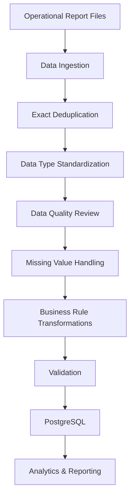

# Large-Scale Data Pipeline & Reporting Automation

A technical case study of an end-to-end data pipeline built to process, validate, transform, and publish large operational datasets for analytics and reporting.

The system combines **Python, Pandas, SQL, PostgreSQL, browser automation, and scheduled execution** to turn continuously arriving operational reports into a reliable analytical dataset containing millions of records.

> **Note:** This repository documents a real production data project. Production source code, operational datasets, credentials, internal systems, and proprietary business rules are intentionally excluded for confidentiality.

---

## Project Overview

This project was designed to replace repetitive manual data-processing tasks with a reliable and repeatable workflow.

The pipeline handles both historical and newly arriving operational data and covers the full processing lifecycle:

- Data ingestion
- Exact duplicate removal
- Data type standardization
- Data quality review
- Missing-value handling
- Business-rule transformations
- Incremental processing
- Validation
- PostgreSQL loading
- Automated report acquisition
- Scheduled daily execution
- Missed-run recovery
- Reporting-ready data publication

The main objective was not simply to clean a dataset once.

It was to build a system capable of continuously transforming raw operational data into validated, analysis-ready information.

---

## Business Problem

Operational data was generated as large report files that required repeated manual preparation before it could be used reliably for analytics and reporting.

The main challenges included:

- Large volumes of historical and daily data
- Duplicate records across overlapping report files
- Inconsistent data types and formatting
- Missing or incomplete values in important fields
- Repeated business-rule transformations
- New data arriving continuously
- Manual report acquisition
- The need to keep analytical data synchronized with new records
- Missed scheduled runs that could create gaps in reporting coverage
- The risk of inconsistent results when transformations were performed manually

The goal was to create a controlled workflow that could process both historical and newly arriving data consistently while reducing manual intervention.

---

## Solution

I developed a staged data-processing pipeline that separates ingestion, cleaning, transformation, validation, and database publication into controlled processing steps.

The solution was designed around several principles:

- Preserve raw source data
- Apply repeatable transformation rules
- Validate data before publication
- Process new data incrementally
- Prevent duplicate ingestion
- Recover missed reporting periods
- Maintain traceability through logging
- Keep the analytical database continuously updated

---

## Architecture Overview

---

## Additional Documentation

For a deeper look at the project design and reliability approach:

- [Technical Design](docs/technical-design.md)
- [Data Quality & Reliability](docs/data-quality-and-reliability.md)
