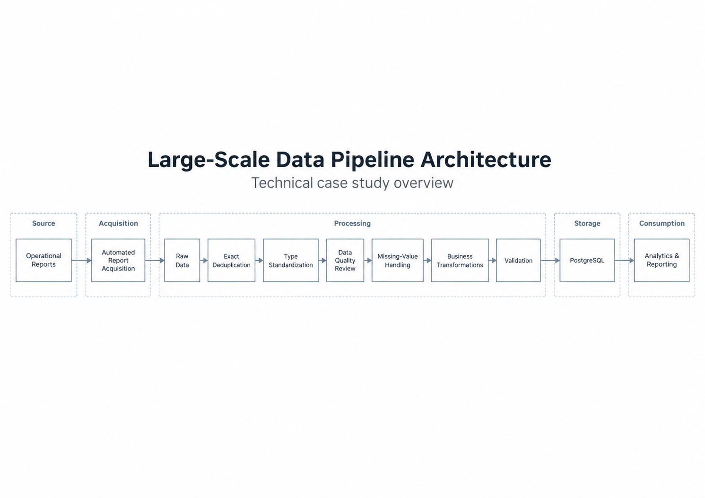

# Architecture Diagrams

This folder contains visual documentation for the architecture and automated workflows of the Large-Scale Data Pipeline project.

The diagrams are intended to provide a high-level technical view of the system without exposing production source code, internal infrastructure, confidential business rules, or operational data.

## Planned Diagrams

### Pipeline Architecture

A high-level view of the complete data flow:

Operational Reports → Acquisition → Data Processing → Validation → PostgreSQL → Analytics & Reporting

### Automation Workflow

A representation of the scheduled daily workflow, including:

- Reporting-period detection
- Automated report acquisition
- File validation
- Incremental ingestion
- Data validation
- PostgreSQL update
- Post-ingestion verification
- Execution logging

### Recovery Workflow

A simplified view of how the system detects and recovers missing reporting periods after unsuccessful or missed scheduled executions.

## Confidentiality

All diagrams in this repository are simplified architectural representations.

Internal systems, credentials, production infrastructure details, proprietary transformation logic, and confidential business information are intentionally excluded.
## Pipeline Architecture

The following diagram provides a simplified view of the end-to-end data flow, from operational report acquisition through processing, validation, analytical storage, and reporting.

